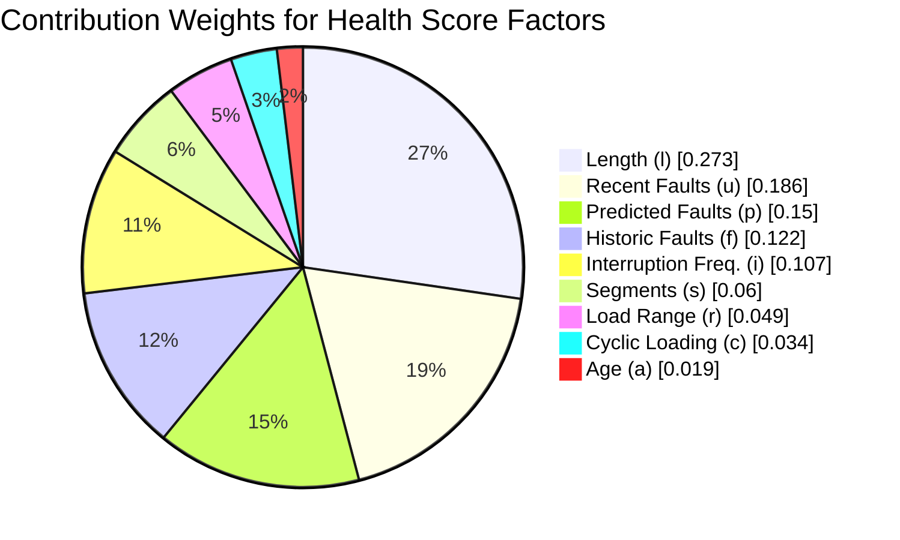

```mermaid

pie showData
    title Contribution Weights for Health Score Factors
    "Length (l)" : 0.273
    "Recent Faults (u)" : 0.186
    "Predicted Faults (p)" : 0.150
    "Historic Faults (f)" : 0.122
    "Interruption Freq. (i)" : 0.107
    "Segments (s)" : 0.060
    "Load Range (r)" : 0.049
    "Cyclic Loading (c)" : 0.034
    "Age (a)" : 0.019
```