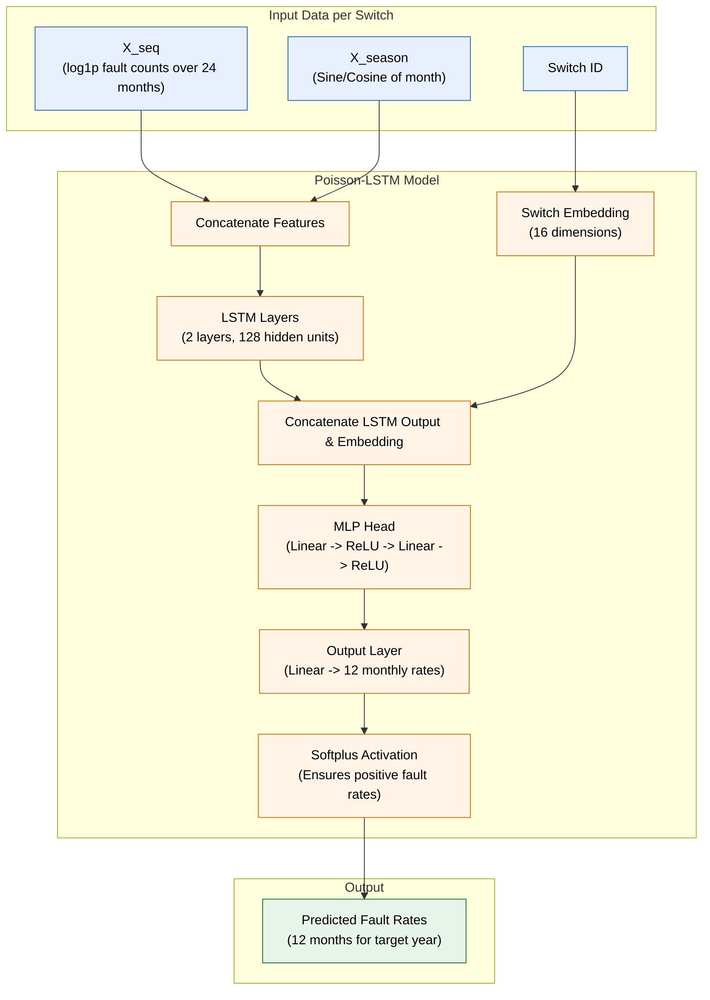

```mermaid
%%{ init: { "flowchart": { htmlLabels: false, useMaxWidth: false } } }%%
flowchart TD
    subgraph Input["Input Data per Switch"]
        X_seq["X_seq\n(log1p fault counts over 24 months)"]
        X_season["X_season\n(Sine/Cosine of month)"]
        SW_ID["Switch ID"]
    end

    subgraph Model["Poisson-LSTM Model"]
        A["Concatenate Features"]
        B["LSTM Layers\n(2 layers, 128 hidden units)"]
        C["Switch Embedding\n(16 dimensions)"]
        D["Concatenate LSTM Output & Embedding"]
        E["MLP Head\n(Linear -> ReLU -> Linear -> ReLU)"]
        F["Output Layer\n(Linear -> 12 monthly rates)"]
        G["Softplus Activation\n(Ensures positive fault rates)"]
    end

    subgraph Output["Output"]
        P["Predicted Fault Rates\n(12 months for target year)"]
    end

    X_seq --> A
    X_season --> A
    A --> B
    SW_ID --> C

    B --> D
    C --> D

    D --> E --> F --> G --> P

    classDef data fill:#E8F0FE,stroke:#1967D2,color:#000
    classDef model_layer fill:#FFF4E6,stroke:#D66E00,color:#000
    classDef output fill:#E6F4EA,stroke:#137333,color:#000

    class X_seq,X_season,SW_ID data
    class A,B,C,D,E,F,G model_layer
    class P output
```