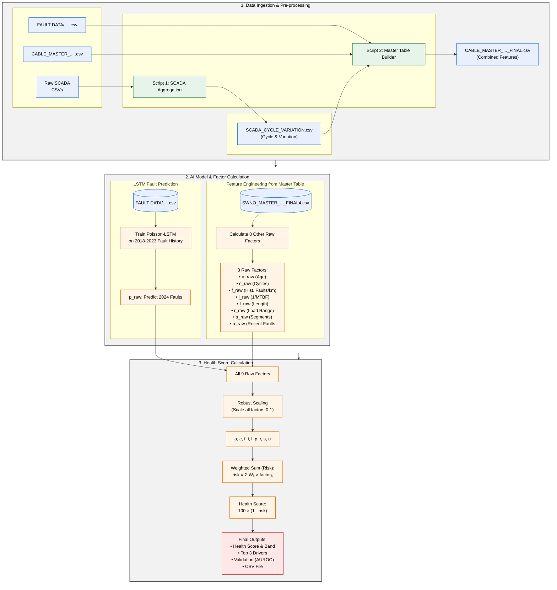

```mermaid
%% HT-Cable Health Score Pipeline
flowchart TB

%% STAGE 1: INPUTS
subgraph INPUTS["1. Data Ingestion & Pre-processing"]
    direction LR
    subgraph " "
        direction TB
        scada_csvs["Raw SCADA<br/>CSVs"]
        cable_master["CABLE_MASTER_... .csv"]
        fault_hist_csv["FAULT DATA/... .csv"]
    end

    subgraph " "
        direction TB
        script1["Script 1: SCADA Aggregation"]
        script2["Script 2: Master Table Builder"]
    end

    subgraph " "
        direction TB
        scada_out["SCADA_CYCLE_VARIATION.csv<br/>(Cycle & Variation)"]
    end

    master_out["CABLE_MASTER_..._FINAL.csv<br/>(Combined Features)"]
    scada_csvs --> script1 --> scada_out
    fault_hist_csv --> script2
    cable_master --> script2
    scada_out --> script2
    script2 --> master_out
end

%% STAGE 2: MODELING & FEATURE ENGINEERING
subgraph MODELING["2. AI Model & Factor Calculation"]
    direction TB

    subgraph "LSTM Fault Prediction"
        direction LR
        fault_hist_csv2[("FAULT DATA/... .csv")] --> train_lstm["Train Poisson-LSTM<br/>on 2018-2023 Fault History"]
        train_lstm --> lstm_preds["p_raw: Predict 2024 Faults"]
    end

    subgraph "Feature Engineering from Master Table"
        master_out2[("SWNO_MASTER_..._FINAL4.csv")]
        master_out2 --> calc_raw["Calculate 8 Other Raw Factors"]
        calc_raw --> raw_factors["8 Raw Factors:<br/>• a_raw (Age)<br/>• c_raw (Cycles)<br/>• f_raw (Hist. Faults/km)<br/>• i_raw (1/MTBF)<br/>• l_raw (Length)<br/>• r_raw (Load Range)<br/>• s_raw (Segments)<br/>• u_raw (Recent Faults"]
    end
end

%% STAGE 3: SCORING & OUTPUT
subgraph SCORING["3. Health Score Calculation"]
    direction TB
    all_raw_factors["All 9 Raw Factors"]
    all_raw_factors --> robust_scale["Robust Scaling<br/>(Scale all factors 0-1)"]
    robust_scale --> scaled_factors["a, c, f, i, l, p, r, s, u"]
    scaled_factors --> weighted_sum["Weighted Sum (Risk):<br/>risk = Σ Wₖ × factorₖ"]
    weighted_sum --> health_score["Health Score:<br/>100 × (1 - risk)"]
    health_score --> final_outputs["Final Outputs:<br/>• Health Score & Band<br/>• Top 3 Drivers<br/>• Validation (AUROC)<br/>• CSV File"]
end

%% WIRING
INPUTS --> MODELING
lstm_preds --> all_raw_factors
raw_factors --> all_raw_factors
MODELING --> SCORING

%% STYLING
classDef stage fill:#F2F2F2,stroke:#333,stroke-width:2px,color:#000
classDef io fill:#E8F0FE,stroke:#1967D2,color:#000,stroke-width:1.2px
classDef script fill:#E6F4EA,stroke:#137333,color:#000,stroke-width:1.2px
classDef process fill:#FFF4E6,stroke:#D66E00,color:#000,stroke-width:1.2px
classDef final fill:#FFE7E7,stroke:#A50E0E,color:#000,stroke-width:1.2px

class INPUTS,MODELING,SCORING stage
class scada_csvs,cable_master,fault_hist_csv,scada_out,master_out,fault_hist_csv2,master_out2,final_outputs io
class script1,script2 script
class train_lstm,lstm_preds,calc_raw,raw_factors,all_raw_factors,robust_scale,scaled_factors,weighted_sum,health_score process
class final_outputs final
```