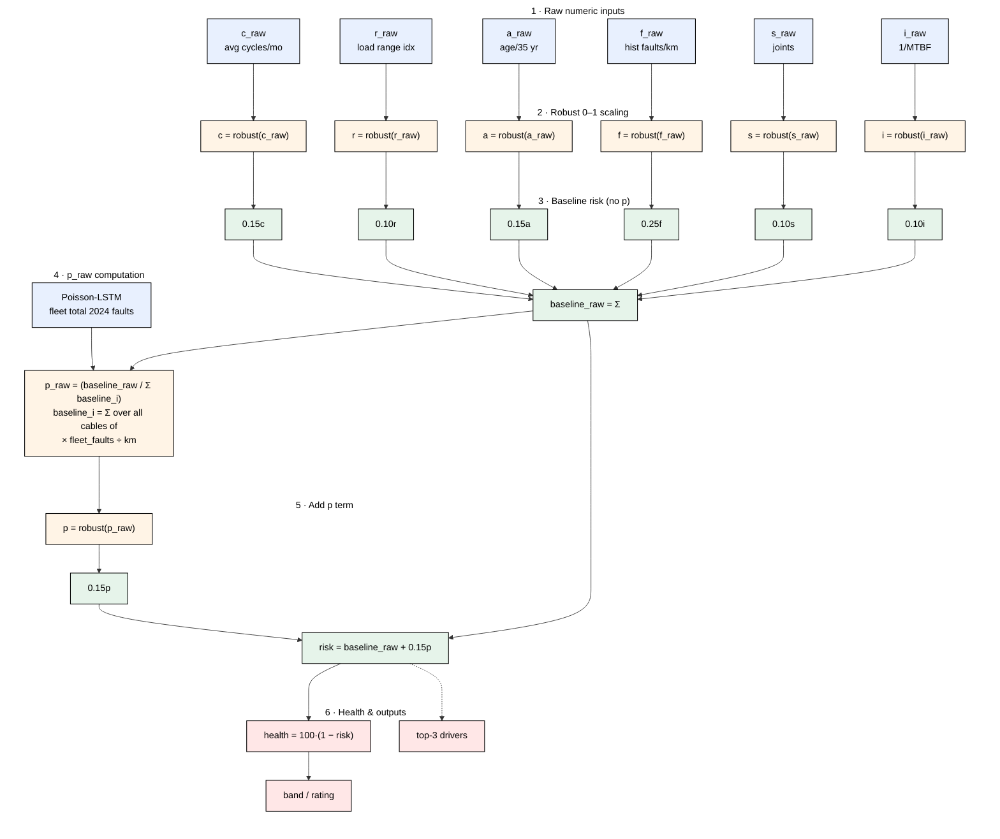

```mermaid
%% HT-Cable Poisson-LSTM + Health-Score (2018–2024) — Portrait Layout (Black Borders)
flowchart TB

%% ───────────────────────── 1 · Raw numeric inputs ─────────────────────────
subgraph RAW["1 · Raw numeric inputs"]
    c_raw["c_raw<br/>avg cycles/mo"]
    r_raw["r_raw<br/>load range idx"]
    a_raw["a_raw<br/>age/35 yr"]
    f_raw["f_raw<br/>hist faults/km"]
    s_raw["s_raw<br/>joints"]
    i_raw["i_raw<br/>1/MTBF"]
end
class RAW none
class c_raw,r_raw,a_raw,f_raw,s_raw,i_raw blue

%% ───────────────────────── 2 · Robust 0–1 scaling ─────────────────────────
subgraph SCALE["2 · Robust 0–1 scaling"]
    c_s["c = robust(c_raw)"]
    r_s["r = robust(r_raw)"]
    a_s["a = robust(a_raw)"]
    f_s["f = robust(f_raw)"]
    s_s["s = robust(s_raw)"]
    i_s["i = robust(i_raw)"]
end
class SCALE none
class c_s,r_s,a_s,f_s,s_s,i_s orange

%% ───────────────────────── 3 · Baseline risk (no p) ───────────────────────
subgraph BASE["3 · Baseline risk (no p)"]
    wc["0.15c"]
    wr["0.10r"]
    wa["0.15a"]
    wf["0.25f"]
    ws["0.10s"]
    wi["0.10i"]
    base["baseline_raw = Σ"]
end
class BASE none
class wc,wr,wa,wf,ws,wi,base green

%% ───────────────────────── 4 · p_raw computation ──────────────────────────
subgraph PRAW["4 · p_raw computation"]
    lstm["Poisson-LSTM<br/>fleet total 2024 faults"]
    p_form["p_raw = (baseline_raw / Σ baseline_i)<br/>baseline_i = Σ over all cables of<br/>× fleet_faults ÷ km"]
end
class PRAW none
class lstm blue
class p_form orange

%% ───────────────────────── 5 · Add p term ─────────────────────────────────
subgraph ADDP["5 · Add p term"]
    p_s["p = robust(p_raw)"]
    wp["0.15p"]
    risk["risk = baseline_raw + 0.15p"]
end
class ADDP none
class p_s orange
class wp,risk green

%% ───────────────────────── 6 · Health & outputs ───────────────────────────
subgraph OUTS["6 · Health & outputs"]
    health["health = 100·(1 − risk)"]
    band["band / rating"]
    drivers["top-3 drivers"]
end
class OUTS none
class health,band,drivers red

%% ───────────────────────── Wiring ─────────────────────────────────────────
c_raw --> c_s --> wc --> base
r_raw --> r_s --> wr --> base
a_raw --> a_s --> wa --> base
f_raw --> f_s --> wf --> base
s_raw --> s_s --> ws --> base
i_raw --> i_s --> wi --> base

base --> p_form
lstm --> p_form
p_form --> p_s --> wp --> risk
base --> risk
risk --> health --> band
risk -.-> drivers

%% ───────────────────────── styles (black borders) ─────────────────────────
classDef none  fill:#FFFFFF,stroke:#000000,stroke-width:0px,color:#000
classDef blue  fill:#E8F0FE,stroke:#000000,color:#000,stroke-width:1.2px
classDef orange fill:#FFF4E6,stroke:#000000,color:#000,stroke-width:1.2px
classDef green fill:#E6F4EA,stroke:#000000,color:#000,stroke-width:1.2px
classDef red   fill:#FFE7E7,stroke:#000000,color:#000,stroke-width:1.2px
```