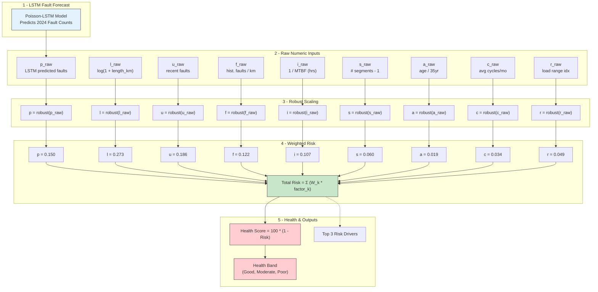

```mermaid
graph TD
    subgraph "1 - LSTM Fault Forecast"
        A["Poisson-LSTM Model<br/>Predicts 2024 Fault Counts"];
    end

    subgraph "2 - Raw Numeric Inputs"
        direction LR
        B1["p_raw<br/>LSTM predicted faults"];
        B2["l_raw<br/>log(1 + length_km)"];
        B3["u_raw<br/>recent faults"];
        B4["f_raw<br/>hist. faults / km"];
        B5["i_raw<br/>1 / MTBF (hrs)"];
        B6["s_raw<br/># segments - 1"];
        B7["a_raw<br/>age / 35yr"];
        B8["c_raw<br/>avg cycles/mo"];
        B9["r_raw<br/>load range idx"];
    end

    A --> B1;

    subgraph "3 - Robust Scaling"
        direction LR
        C1["p = robust(p_raw)"];
        C2["l = robust(l_raw)"];
        C3["u = robust(u_raw)"];
        C4["f = robust(f_raw)"];
        C5["i = robust(i_raw)"];
        C6["s = robust(s_raw)"];
        C7["a = robust(a_raw)"];
        C8["c = robust(c_raw)"];
        C9["r = robust(r_raw)"];
    end

    B1 --> C1;
    B2 --> C2;
    B3 --> C3;
    B4 --> C4;
    B5 --> C5;
    B6 --> C6;
    B7 --> C7;
    B8 --> C8;
    B9 --> C9;

    subgraph "4 - Weighted Risk"
        D1["p = 0.150"];
        D2["l = 0.273"];
        D3["u = 0.186"];
        D4["f = 0.122"];
        D5["i = 0.107"];
        D6["s = 0.060"];
        D7["a = 0.019"];
        D8["c = 0.034"];
        D9["r = 0.049"];
        E["Total Risk = Σ (W_k * factor_k)"];
    end

    C1 --> D1;
    C2 --> D2;
    C3 --> D3;
    C4 --> D4;
    C5 --> D5;
    C6 --> D6;
    C7 --> D7;
    C8 --> D8;
    C9 --> D9;

    D1 --> E;
    D2 --> E;
    D3 --> E;
    D4 --> E;
    D5 --> E;
    D6 --> E;
    D7 --> E;
    D8 --> E;
    D9 --> E;

    subgraph "5 - Health & Outputs"
        F["Health Score = 100 * (1 - Risk)"];
        G["Top 3 Risk Drivers"];
        H["Health Band<br/>(Good, Moderate, Poor)"];
    end

    E --> F;
    E -.-> G;
    F --> H;

    style A fill:#e3f2fd,stroke:#333
    style E fill:#c8e6c9,stroke:#333
    style F fill:#ffcdd2,stroke:#333
    style H fill:#ffcdd2,stroke:#333
```