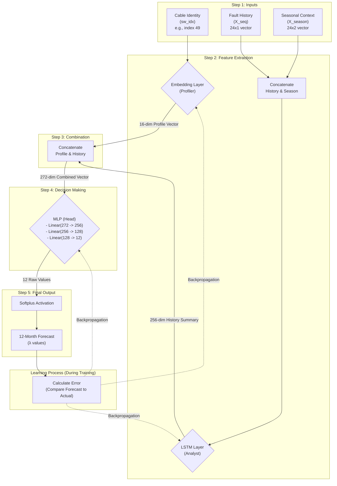

```mermaid
graph TD
    subgraph "Step 1: Inputs"
        A["Cable Identity<br/>(sw_idx)<br/>e.g., index 49"]
        B["Fault History<br/>(X_seq)<br/>24x1 vector"]
        C["Seasonal Context<br/>(X_season)<br/>24x2 vector"]
    end

    subgraph "Step 2: Feature Extraction"
        A --> E{"Embedding Layer<br/>(Profiler)"};
        B --> D["Concatenate<br/>History & Season"];
        C --> D;
        D --> F{"LSTM Layer<br/>(Analyst)"};
    end

    subgraph "Step 3: Combination"
       E -- "16-dim Profile Vector" --> G["Concatenate<br/>Profile & History"];
       F -- "256-dim History Summary" --> G;
    end

    subgraph "Step 4: Decision Making"
        G -- "272-dim Combined Vector" --> H{"MLP (Head)<br/>- Linear(272 -> 256)<br/>- Linear(256 -> 128)<br/>- Linear(128 -> 12)"};
    end

    subgraph "Step 5: Final Output"
        H -- "12 Raw Values" --> I["Softplus Activation"];
        I --> J["12-Month Forecast<br/>(λ values)"];
    end

    subgraph "Learning Process (During Training)"
        K["Calculate Error<br/>(Compare Forecast to Actual)"]
        J --> K;
        K -.->|Backpropagation| H;
        K -.->|Backpropagation| F;
        K -.->|Backpropagation| E;
    end
```